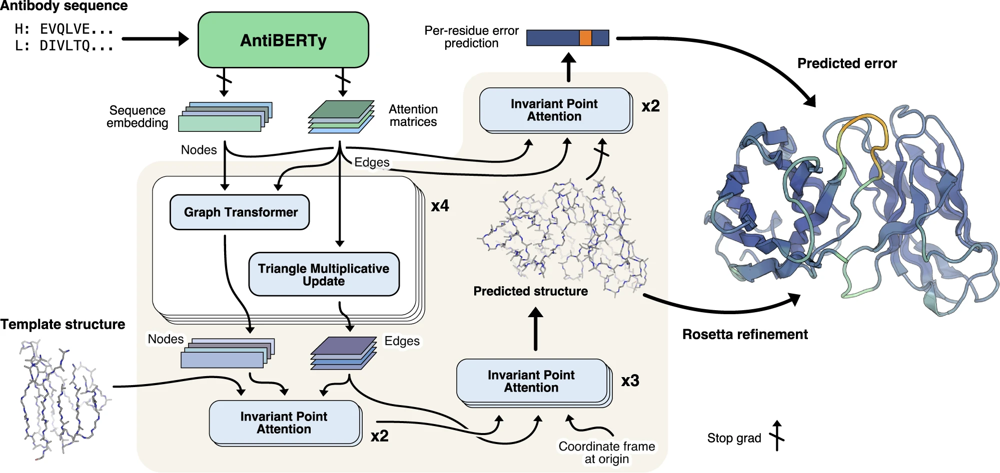

## IgFold
A fast deep learning method for antibody structure prediction. IgFold consists of a pre-trained language model trained on 558 million natural antibody sequences followed by graph networks that directly predict backbone atom coordinates. IgFold predicts structures of similar or better quality than alternative methods (including AlphaFold) in significantly less time (under 25 s).

## Diagram of method for end-to-end prediction of antibody structures.
.

## Install
For easiest use, create a conda environment and install IgFold via PyPI:
```
pip install igfold
```

### Refinement
Two refinement methods are supported for IgFold predictions. To follow the manuscript, PyRosetta should be installed following the instructions [here](http://pyrosetta.org/downloads). If PyRosetta is not installed, refinement with OpenMM will be attempted. For this option, OpenMM must be installed and configured before running IgFold as follows:
```
conda install -c conda-forge openmm==7.7.0 pdbfixer
```

### Renumbering
Antibody renumbering requires installation of AbNumber. To install AbNumber, run the following command:
```
$ conda install -c bioconda abnumber
```

## IgFold Architecture
### Input: Antibody Sequence(s)
- Works with paired heavy/light chains or single chains (e.g., nanobodies).
- Input = amino acid sequence(s).

### Antibody Language Model Embeddings (AntiBERTy)
- AntiBERTy, a transformer pretrained on 558 million natural antibody sequences.
- Two outputs are extracted:
  - Residue embeddings (per-position vectors) → used as node features. Attention weights (from transformer heads) → used as edge features (pairwise relationships).
  - This step encodes antibody-specific sequence priors, especially CDR statistics.

### Graph Neural Network (GNN) Backbone
- Antibody structure is modeled as a graph:
  - Nodes = residues (with embeddings).
  - Edges = residue–residue relationships (from AntiBERTy attentions, sequence adjacency, and optional structural templates).
- Message passing updates node and edge representations.

### Invariant Point Attention (IPA) Layers
- Borrowed from AlphaFold’s design.
- Key idea: attention is computed in 3D space and is equivariant to rotations and translations.
- Function: Nodes attend to each other not only via sequence embeddings but also via their evolving 3D coordinates. This helps place residues correctly in space, preserving geometric constraints.

### Coordinate Prediction
- The network directly outputs 3D coordinates for backbone atoms (N, Cα, C, O).
- Side chains are added later.
- The model outputs an ensemble of predictions (4 models trained separately).

### Error Prediction Module
- Alongside coordinates, IgFold predicts a per-residue deviation score (like AlphaFold’s pLDDT).
- Especially useful for CDR H3, where errors are common.

### Refinement Step
- Lightweight refinement (PyTorch + Rosetta) enforces bond geometry and adds side chains.
- Much faster than full AlphaFold relaxation (~seconds vs. minutes).

### Template Integration (Optional)
- If partial structure (template) is available (e.g., one chain crystallized), it can be added as constraints.
- This is encoded as additional edge features guiding the GNN.

### Model Selection
- Run all 4 trained models → each produces a structure + error estimate.
- Choose the best prediction using the 90th-percentile per-residue error.
  - Idea: a single bad loop shouldn’t ruin the whole structure.

## Usage
Input antibody Fv sequences
```
import os
import sys

python_version = f"{sys.version_info.major}.{sys.version_info.minor}"

name = "my_antibody"
pred_dir = name
os.makedirs(pred_dir, exist_ok=True)

heavy_sequence = "EVQLVQSGPEVKKPGTSVKVSCKASGFTFMSSAVQWVRQARGQRLEWIGWIVIGSGNTNYAQKFQERVTITRDMSTSTAYMELSSLRSEDTAVYYCAAPYCSSISCNDGFDIWGQGTMVTVS"
light_sequence = "DVVMTQTPFSLPVSLGDQASISCRSSQSLVHSNGNTYLHWYLQKPGQSPKLLIYKVSNRFSGVPDRFSGSGSGTDFTLKISRVEAEDLGVYFCSQSTHVPYTFGGGTKLEIK"

sequences = {}
if len(heavy_sequence) > 0:
    sequences["H"] = heavy_sequence
if len(light_sequence) > 0:
    sequences["L"] = light_sequence

# Perform structural refinement with OpenMM
do_refine = True
# Renumber predicted antibody structure (Chothia) with AbNumber
do_renum = False
# Use only a single model for predictions (instead of model ensemble)
single_model = False
```

Predict antibody structure with IgFold
```
from igfold.utils.visualize import *
from igfold import IgFoldRunner

num_models = 1 if single_model else 4
igfold = IgFoldRunner(num_models=num_models)

pred_pdb = os.path.join(pred_dir, f"{name}.pdb")
pred = igfold.fold(
    pred_pdb,
    sequences=sequences,
    do_refine=do_refine,
    use_openmm=True,
    do_renum=do_renum,
)
show_pdb(pred_pdb, len(sequences), bb_sticks=False, sc_sticks=True, color="rainbow")
```

Plot per-residue predicted RMSD
```
prmsd_fig_file = os.path.join(pred_dir, f"{name}_prmsd.png")
plot_prmsd(sequences, pred.prmsd.cpu(), prmsd_fig_file, shade_cdr=do_renum, pdb_file=pred_pdb)
```

Show predicted structure with predicted RMSD
```
show_pdb(pred_pdb, len(sequences), bb_sticks=False, sc_sticks=True, color="b")
```

## 
https://www.nature.com/articles/s41467-023-38063-x
