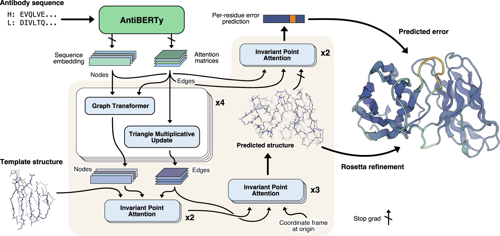

## Transformer in Single-Cell Omics
Transformers allow machines not just to compute gene expression—but to comprehend it. In this data-driven era of biology, the Transformer is more than an algorithm; it’s a new way of thinking. When AI can understand cells, we move one step closer to truly computational life science.

## From Natural Language to Cellular Language.
The Transformer model, introduced by Google in 2017, was originally designed for natural language processing (NLP).
It uses a self-attention mechanism to understand complex relationships between words—enabling machines to truly grasp semantics.

In single-cell omics, we also have a language — the language of cellular expression:
- Gene expression matrices act like words in a sentence;
- Each cell is a paragraph;
- Co-expression between genes resembles grammatical structure.

This leads to a powerful idea:
If Transformers can understand human language, maybe they can understand cellular language too.
.

## How Transformers Are Changing Single-Cell Analysis
Traditional single-cell analyses rely on PCA, UMAP, or graph neural networks (GNNs).
While useful, these methods struggle to capture high-order dependencies and often lack generalization power.
Transformers, however, are reshaping the field—bringing the era of “AI understanding” to single-cell biology.

## Three major application areas
### Expression Understanding: Teaching Models to “Read” Gene Profiles.
Representative works: scBERT, Geneformer
- scBERT (Nature Machine Intelligence, 2023)
Treats gene expression vectors as “words” and cells as “sentences.” \
Through masked modeling, it learns contextual gene relationships.
- Geneformer (bioRxiv, 2023)
Pretrained on over 30 million single cells, it’s often dubbed the “GPT of single-cell biology.” 

It can be fine-tuned for downstream tasks such as:
- Cell type classification
- Regulatory network inference
- Expression imputation

Key insight:
Pretraining + fine-tuning enables a universal understanding of cellular expression.
show_pdb(pred_pdb, len(sequences), bb_sticks=False, sc_sticks=True, color="b")

### Multi-Modal Integration: Bridging RNA, ATAC, and Spatial Data
Representative works: scMoFormer, UniFormer, scFoundation
The multi-head attention mechanism in Transformers naturally supports multi-modal data fusion:
- RNA + ATAC + protein + spatial modalities can be modeled jointly;
- Models can transfer knowledge across modalities and correct batch effects. 

Examples include:
- scMoFormer: aligns latent features across omics;
- scFoundation: acts as a foundation model for universal single-cell representation, enabling cross-species generalization.
For the first time, we are seeing the emergence of general-purpose single-cell foundation models.

### Spatial Omics and Structural Learning: Understanding Cellular “Context”
In spatial transcriptomics, cells’ physical positions mirror the word order in sentences.
Models like SpatialFormer and STFormer use attention to capture signals from neighboring cells, learning the structural organization of tissues.

Applications include:

- Automated tissue region segmentation
- Joint modeling of histology and transcriptomics
- Discovery of spatially defined subpopulations

Transformers help AI not only “see” cells but also understand their spatial context.

## From “Black Box” Algorithms to “Explainable Biology”
A major advantage of Transformers is interpretability.
Their attention weights can reveal:
- Which genes the model focuses on most;
- Which regulatory modules are activated;
- Which cross-modal signals drive predictions.

This shifts deep learning from being a black box to a biologically interpretable hypothesis generator.

## The Future: The “GPT Moment” for Single-Cell Biology
- Unified single-cell foundation models
- Cross-species and cross-tissue transfer learning
- Model-driven predictions of cell fate and drug response

Just as BERT and GPT transformed language understanding, Transformers are transforming how we understand the language of life.
