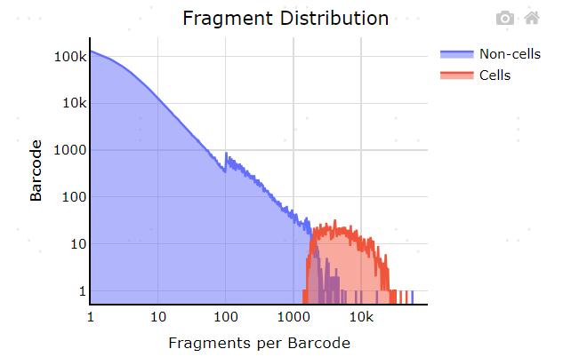

## annotatePeaks
Homer contains a useful, all-in-one program for performing peak annotation called annotatePeaks.pl. In addition to associating peaks with nearby genes, annotatePeaks.pl can perform Gene Ontology Analysis, genomic feature association analysis (Genome Ontology), associate peaks with gene expression data, calculate ChIP-Seq Tag densities from different experiments, and find motif occurrences in peaks.  annotatePeaks.pl can also be used to create histograms and heatmaps.

## Basic usage
```
annotatePeaks.pl <peak/BED file> <genome>   > <output file>
i.e. annotatePeaks.pl ERpeaks.txt hg18   > outputfile.txt
```
The first two arguments, the <peak file> and <genome>, are required, and must be the first two arguments. 
## Example of the output 
.
```
Description of Columns:
Peak ID
Chromosome
Peak start position
Peak end position
Strand
Peak Score
FDR/Peak Focus Ratio/Region Size
Annotation (i.e. Exon, Intron, ...)
Detailed Annotation (Exon, Intron etc. + CpG Islands, repeats, etc.)
Distance to nearest RefSeq TSS
Nearest TSS: Native ID of annotation file
Nearest TSS: Entrez Gene ID
Nearest TSS: Unigene ID
Nearest TSS: RefSeq ID
Nearest TSS: Ensembl ID
Nearest TSS: Gene Symbol
Nearest TSS: Gene Aliases
Nearest TSS: Gene description
```
## Input files
HOMER peak files or BED files
```
HOMER peak files should have at minimum 5 columns (separated by TABs, additional columns will be ignored):
Column1: Unique Peak ID
Column2: chromosome
Column3: starting position
Column4: ending position
Column5: Strand (+/- or 0/1, where 0="+", 1="-")
```
```
BED files should have at minimum 6 columns (separated by TABs, additional columns will be ignored)
Column1: chromosome
Column2: starting position
Column3: ending position
Column4: Unique Peak ID
Column5: not used
Column6: Strand (+/- or 0/1, where 0="+", 1="-")
```

## How Basic Annotation Works
The process of annotating peaks/regions is divided into two primary parts.  The first determines the distance to the nearest TSS and assigns the peak to that gene. The second determines the genomic annotation of the region occupied by the center of the peak/region.
