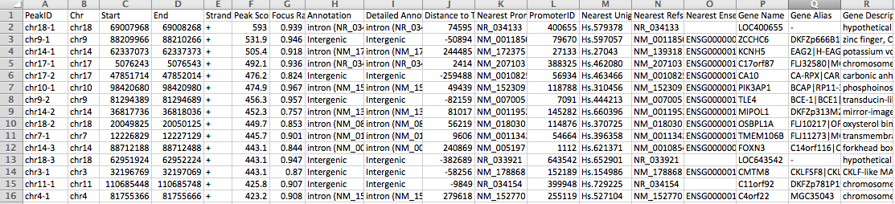

## annotatePeaks
Homer contains a useful, all-in-one program for performing peak annotation called annotatePeaks.pl. In addition to associating peaks with nearby genes, annotatePeaks.pl can perform Gene Ontology Analysis, genomic feature association analysis (Genome Ontology), associate peaks with gene expression data, calculate ChIP-Seq Tag densities from different experiments, and find motif occurrences in peaks.  annotatePeaks.pl can also be used to create histograms and heatmaps.

## Basic usage
```
annotatePeaks.pl <peak/BED file> <genome>   > <output file>
i.e. annotatePeaks.pl ERpeaks.txt hg18   > outputfile.txt
```
The first two arguments, the <peak file> and <genome>, are required, and must be the first two arguments. 
## Example of the output 
.
```
Description of Columns:
Peak ID
Chromosome
Peak start position
Peak end position
Strand
Peak Score
FDR/Peak Focus Ratio/Region Size
Annotation (i.e. Exon, Intron, ...)
Detailed Annotation (Exon, Intron etc. + CpG Islands, repeats, etc.)
Distance to nearest RefSeq TSS
Nearest TSS: Native ID of annotation file
Nearest TSS: Entrez Gene ID
Nearest TSS: Unigene ID
Nearest TSS: RefSeq ID
Nearest TSS: Ensembl ID
Nearest TSS: Gene Symbol
Nearest TSS: Gene Aliases
Nearest TSS: Gene description
```
## Input files
HOMER peak files or BED files
```
HOMER peak files should have at minimum 5 columns (separated by TABs, additional columns will be ignored):
Column1: Unique Peak ID
Column2: chromosome
Column3: starting position
Column4: ending position
Column5: Strand (+/- or 0/1, where 0="+", 1="-")
```
```
BED files should have at minimum 6 columns (separated by TABs, additional columns will be ignored)
Column1: chromosome
Column2: starting position
Column3: ending position
Column4: Unique Peak ID
Column5: not used
Column6: Strand (+/- or 0/1, where 0="+", 1="-")
```

## How Basic Annotation Works
The process of annotating peaks/regions is divided into two primary parts.  The first determines the distance to the nearest TSS and assigns the peak to that gene. The second determines the genomic annotation of the region occupied by the center of the peak/region.
### Distance to the nearest TSS
By default, annotatePeaks.pl loads a file in the "/path-to-homer/data/genomes/<genome>/<genome>.tss" that contains the positions of RefSeq transcription start sites.  It uses these positions to determine the closest TSS, reporting the distance (negative values mean upstream of the TSS, positive values mean downstream), and various annotation information linked to each locus including alternative identifiers (unigene, entrez gene, ensembl, gene symbol etc.).  This information is also used to link gene-specific information (see below) to a peak/region, such as gene expression.
### Genomic Annotation
To annotate the location of a given peak in terms of important genomic features, annotatePeaks.pl calls a separate program (assignGenomeAnnotation) to efficiently assign peaks to one of millions of possible annotations genome wide.  Two types of output are provided.  The first is "Basic Annotation" that includes whether a peak is in the TSS (transcription start site), TTS (transcription termination site), Exon (Coding), 5' UTR Exon, 3' UTR Exon, Intronic, or Intergenic, which are common annotations that many researchers are interested in.  A second round of "Detailed Annotation" also includes more detailed annotation, considering repeat elements and CpG islands.  Since some annotation overlap, a priority is assign based on the following (in case of ties it's random [i.e. if there are two overlapping repeat element annotations])
```
TSS (by default defined from -1kb to +100bp)
TTS (by default defined from -100 bp to +1kb)
CDS Exons
5' UTR Exons
3' UTR Exons
**CpG Islands
**Repeats
Introns
Intergenic
```
### Calculating Peak Enrichment for Genomic Annotations
In addition to assigning genomic annotations to each peak, this program will also output the relative enrichment of your peaks in each set of genomic annotations (i.e. enrichment of the peaks in promoter regions, exons, CpG Islands, etc.). This calculation is performed by first identifying the fraction of the annotated genome assigned to each annotation. This is used to establish the expected distribution of peaks for each annotation. This is then compared to the observed fraction of peaks assigned to each annotation, using the binomial distribution to assign a significance p-value. To avoid divide by zero errors, annotations not assigned to a peak are given a pseudo count of one minus the expected fraction of peaks for that annotation when calculating the observed vs. expected log2 ratios and p-values.
