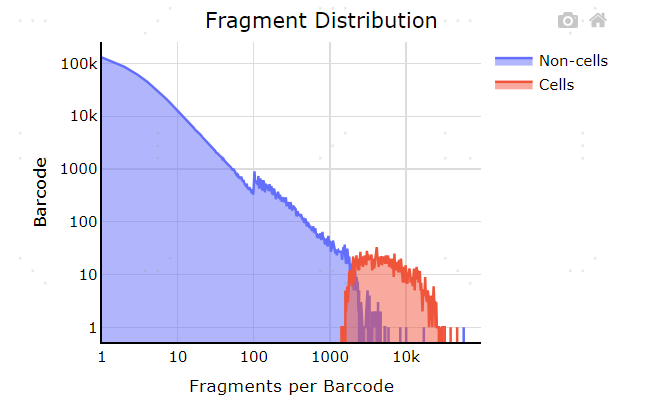

## Use plotly package to generate fragment distribution plot
Histograms of number of fragments per cell barcode for non-cells and cells.

## Package installation
```
pip install plotly
```

## Input file
Analyze a single-cell ATAC-seq dataset provided by Celescope-ATAC.
1. cell_qc_metrics.tsv

## Pre-processing
Change cell_called label.
```
df = pd.read_csv("cell_qc_metrics.tsv", sep='\t')
df['cell_called'] = df.apply(label, axis=1)
def label(df):
    if df["cell_called"] == True:
        return "Cells"
    else:
        return "Non-cells"
```
Calculate data metrics for plot
```
def calculate_metrics(df):
    singlecell_df = df
    fragment_counts = singlecell_df['fragments'].values
    cell_mask = (singlecell_df['cell_called']=='Cells')
    noncell_mask = (singlecell_df['cell_called']=='Non-cells')

    logbinmax = np.ceil(np.log10(fragment_counts.max()))
    xbins = list(np.hstack([np.arange(100), np.logspace(np.log10(100), logbinmax, 350)]))
    data_subplots = []
    for name, mask, color in zip(["Non-cells", "{} Cells".format("")],
                                 [noncell_mask, cell_mask],
                                 ["blue", "orange"]):
        # protect against really low depth samples, mixed up ref, severe under cell calling
        if mask.sum() > 0 and logbinmax > np.log10(100):
            counts, _ = np.histogram(fragment_counts[mask], xbins)
            data_subplots.append({
                "name": name,
                "x": xbins,
                "y": list(counts),
                "type": "scatter",
                "connectgaps": True,
                "fill": "tozeroy",
                "line": {"color": color},
            })
    
    return data_subplots

data_subplots = calculate_metrics(df)
```

## Generate Fragment Distribution plot
```
fig = go.Figure()
fig.add_trace(go.Scatter(x=data_subplots[0]['x'], y=data_subplots[0]['y'], fill='tozeroy', connectgaps=True, name='Non-cells')) # fill down to xaxis
fig.add_trace(go.Scatter(x=data_subplots[1]['x'], y=data_subplots[1]['y'], fill='tozeroy', connectgaps=True, name='Cells')) # fill to trace0 y
fig.update_layout(
                width=470, height=470,
                title={"text": "Fragment Distribution",
                    'y':0.98, 'x':0.5, 'xanchor': 'center', 'yanchor': 'top'},
                xaxis={"type": "log", "color": "black", "gridcolor": "gainsboro", "linecolor": "black"},
                yaxis={"type": "log", "color": "black", "gridcolor": "gainsboro", "linecolor": "black"},
                xaxis_title = "Fragments per Barcode", yaxis_title = "Barcode", font=dict(size=12,color="Black"),
                margin=dict(l=50, r=0, t=30, b=30),
                plot_bgcolor="#FFFFFF",
                legend=dict(title_text=''),
            )
fig.write_image(f"FragDisPlot/{sample}.pdf", scale=4,)
```
.
