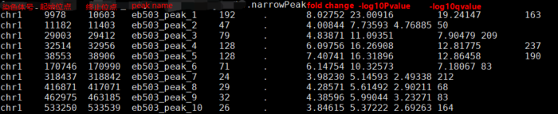

## Peak Calling
Peak calling即利用计算的方法找出ChIP-seq或ATAC-seq中reads富集的基因组区域。

## MACS2

peaks calling 有不同的方法，MACS2是最常用的call peaks工具。 MACS全称Model-based Analysis of ChIP-Seq，最初的设计是用来鉴定转录因子的结合位点，但是它也可以用于其他类型的富集方式测序。
MACS通过整合序列标签位置信息和方向信息提高结合位点的空间分辨率。

## MACS2的使用方法
### 输入文件参数：

-t: 实验组，IP的数据文件。 \
c: 对照组。 \
f：指定输入文件的格式，默认是自动检测输入数据是什么格式，支持bam,sam,bed等。 \
g: 有效基因组大小，由于基因组序列的重复性，基因组实际可以mapping的大小小于原始的基因组。这个参数要根据实际物种计算基因组的有效大小。软件里也给出了几个默认的-g 值：hs – 2.7e9表示人类的基因组有效大小(UCSC human hg18 assembly). \
hs: 2.7e9 \
mm: 1.87e9 \
ce: 9e7 \
dm: 1.2e8

### 输出文件参数：

--outdir: 输出结果的存储路径 \
-n: 输出文件名的前缀 \
-B/--bdg: 输出bedgraph格式的文件，输出文件以NAME ’_treat_pileup.bdg’ for treatment data, NAME ’_control_lambda.bdg’ for local lambda values from control显示。

### peak calling 参数
-q/--qvalue 和 -p/--pvalue \
q value默认值是0.05，与pvalue不能同时使用。\
--broad \
peak有narrow peak和broad peak, 设置时可以call broad peak 的结果文件。 \
--broad-cutoff \
和pvalue、以及qvalue相似 \
--nolambda: 不要考虑在峰值候选区域的局部偏差/λ \
q值与峰宽有一定的联系。理想情况下，如果放宽阈值，您将简单地获得更多的peaks，但是使用MACS2放松阈值也会导致更宽的peaks。

### Shift 模型参数：
--nomodel \
这个参数和extsize、shift是配套使用的，有这个参数才可以设置extsize和shift。\
--extsize \
当设置了nomodel时，MACS会用--extsize这个参数从5’->3’方向扩展reads修复fragments。比如说你的转录因子结合范围200bp，就设置这个参数是200。\
--shift \
当设置了–nomodel，MACS用这个参数从5’ 端移动剪切，然后用–extsize延伸，如果–shift是负值表示从3’端方向移动。建议ChIP-seq数据集这个值保持默认值为0，对于检测富集剪切位点如DNAsel数据集设置为EXTSIZE的一半。\
示例：\
想找富集剪切位点，如DNAse-seq，所有5’端的序列reads应该从两个方向延伸，如果想设置移动的窗口是200bp，参数设置如下： \
--nomodel --shift -100 --extsize 200 \
对nucleosome-seq数据，用核小体大小的一半进行extsize,所以参数设置如下：\
--nomodel --shift 37 --extsize 73 \
--call-summits \
MACS利用此参数重新分析信号谱，解析每个peak中包含的subpeak。对相似的结合图谱，推荐使用此参数，当使用此参数时，输出的subpeak会有相同的peak边界，不同的绩点和peak summit poisitions.

## ATAC-Seq call peaks示例
ATAC-seq关心的是在哪切断，断点才是peak的中心，所以使用shift模型，–shift -75或-100，对人细胞系ATAC-seq 数据call peak的参数设置如下：
```
macs2 callpeak -t H1hesc.final.bam -n sample --shift -100 --extsize 200 --nomodel -B --SPMR -g hs --outdir Macs2_out 2> sample.macs2.log
```
## MACS2输出文件解读：
### NAME_peaks.xls
包含peak信息的tab分割的文件，前几行会显示callpeak时的命令。输出信息包含：\
· 染色体号 \
· peak起始位点 \
· peak结束位点 \
· peak区域长度 \
· peak的峰值位点（summit position）\
· peak 峰值的高度（pileup height at peak summit, -log10(pvalue) for the peak summit） \
· peak的富集倍数（相对于random Poisson distribution with local lambda） \
Coordinates in XLS is 1-based which is different with BED format \
XLS里的坐标和bed格式的坐标还不一样，起始坐标需要减1才与narrowPeak的起始坐标一样。

### NAME_peaks.narrowPeak
narrowPeak文件是BED6 4格式，可以上传到UCSC浏览。输出文件每列信息分别包含：
· 染色体号 \
· peak起始位点 \
· 结束位点 \
· peak name \
· int(-10*log10qvalue) \
· 正负链 \
· fold change \
· -log10pvalue \
· -log10qvalue \
· relative summit position to peak start \
.

### NAME_summits.bed
BED格式的文件，包含peak的summits位置，第5列是-log10pvalue。如果想找motif，推荐使用此文件。
### NAME_peaks.broadPeak
BED6 3格式与narrowPeak类似，只是没有第10列。

### xls文件
文件包含信息还是比较多的，和narrowPeak唯一不同的是peak的起始位置需要减1才是bed格式的文件，另外还包含fold_enrichment 和narrowPeak的fold change 对应，-log10pvalue,-log10qvalue,peak长度，peak 峰值位置等。
### narrowPeak文件
和xls文件信息类似。
### summits.bed文件
包含峰的位置信息和-log10pvalue。
### bdg文件
bdg文件适合导入UCSC或IGV进行谱图可视化，或者转换为bigwig格式再进行可视化。
