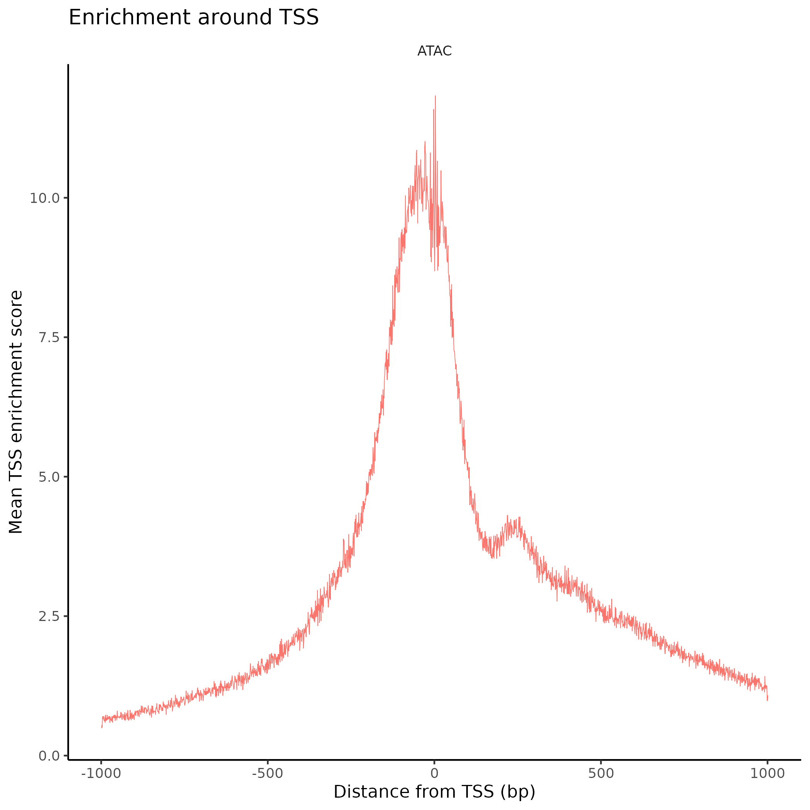

## Use Signac to generate tss plot and tss enrichment score
Signac is designed for the analysis of single-cell chromatin data, including scATAC-seq. scATAC-seq analysis pipeline https://github.com/singleron-RD/CeleScope_ATAC.

Transcriptional start site (TSS) enrichment score: The ENCODE project has defined an ATAC-seq targeting score based on the ratio of fragments centered at the TSS to fragments in TSS-flanking regions (see https://www.encodeproject.org/data-standards/terms/). Poor ATAC-seq experiments typically will have a low TSS enrichment score. We can compute this metric for each cell with the TSSEnrichment() function, and the results are stored in metadata under the column name TSS.enrichment.

## R package installation
```
setRepositories(ind=1:3)
install.packages("Signac")
```

## Input file
Analyze a single-cell ATAC-seq dataset provided by Celescope-ATAC.
1. The Raw data
2. The Metadata
3. The fragments file
4. The fragments file index

## Pre-processing
Peak/Cell matrix. This is analogous to the gene expression count matrix used to analyze single-cell RNA-seq. However, instead of genes, each row of the matrix represents a region of the genome (a peak), that is predicted to represent a region of open chromatin. Each value in the matrix represents the number of Tn5 integration sites for each single barcode (i.e. a cell) that map within each peak.

Fragment file. This represents a full list of all unique fragments across all single cells. It is a substantially larger file, is slower to work with, and is stored on-disk (instead of in memory). However, the advantage of retaining this file is that it contains all fragments associated with each single cell, as opposed to only fragments that map to peaks.
```
counts <- Read10X_h5(filename = "filtered_peak_bc_matrix.h5")
metadata <- read.csv(
  file = "singlecell.csv",
  header = TRUE,
  row.names = 1
)

chrom_assay <- CreateChromatinAssay(
  counts = counts,
  sep = c(":", "-"),
  fragments = "fragments.tsv.gz",
  min.cells = 10,
  min.features = 200
)

obj <- CreateSeuratObject(
  counts = chrom_assay,
  assay = "peaks",
  meta.data = metadata
)
```
Extract gene annotations from EnsDb
```
library(EnsDb.Mmusculus.v79)
library(EnsDb.Hsapiens.v86)

Human:
annotations <- GetGRangesFromEnsDb(ensdb = EnsDb.Hsapiens.v86)
Mouse:
annotations <- GetGRangesFromEnsDb(ensdb = EnsDb.Mmusculus.v79)
```
Change to UCSC style since the data was mapped to hg38
```
seqlevels(annotations) <- paste0('chr', seqlevels(annotations))
Human:
genome(annotations) <- "hg38"
Mouse:
genome(annotations) <- "mm10"
```
Add the gene information to the object
```
Annotation(obj) <- annotations
```

## Compute TSS enrichment score
```
# compute nucleosome signal score per cell
obj <- NucleosomeSignal(object = obj)

# compute TSS enrichment score per cell
obj <- TSSEnrichment(object = obj)
```

## Generate TSS plot
```
TSSPlot(obj) + NoLegend() + ggtitle("Enrichment around TSS")
```
.
