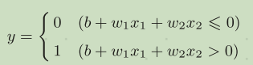

## 感知机
感知机接收多个输入信号，输出一个信号。0对应“不传递信号”，1对应“传递信号”。
x1、x2是输入信号，y是输出信号，w1、w2是权重（w是weight的首字母）。图中的○称为“神经元”或者“节点”。输入信号被送往神经元时，会被分别乘以固定的权重（w1x1、w2x2）。神经元会计算传送过来的信号的总和，只有当这个总和超过了某个界限值时，才会输出1。这也称为“神经元被激活”。这里将这个界限值称为阈值，用符号θ表示。\
 \
感知机的多个输入信号都有各自固有的权重，这些权重发挥着控制各个信号的重要性的作用。也就是说，权重越大，对应该权重的信号的重要性就越高 \

## 简单逻辑电路
### 与门
与门仅在两个输入均为1时输出1，其他时候则输出0。
(w1, w2, θ) = (0.5, 0.5, 0.7), (w1, w2, θ) = (0.5, 0.5, 0.8)或者(1.0, 1.0, 1.0)满足与门的条件。设定这样的参数后，仅当x1和x2同时为1时，信号的加权总和才会超过给定的阈值θ。
### 与非门和或门
与非门就是颠倒了与门的输出,仅当x1和x2同时为1时输出0，其他时候则输出1。
```
(w1, w2, θ) = (−0.5, −0.5, −0.7)
```
或门是“只要有一个输入信号是1，输出就为1”的逻辑电路
```
(w1, w2, θ) = (0.5, 0.5, 0.4)
```
与门、与非门、或门的感知机构造是一样的。3个门电路只有参数的值（权重和阈值）不同。也就是说，相同构造的感知机，只需通过适当地调整参数的值，变为与门、与非门、或门。

## 感知机的实现
```
def AND(x1, x2):
  w1, w2, theta = 0.5, 0.5, 0.7
  tmp = x1*w1 + x2*w2
  if tmp <= theta:
    return 0
  elif tmp > theta:
    return 1

AND(0, 0) # 输出0
AND(1, 0) # 输出0
AND(0, 1) # 输出0
AND(1, 1) # 输出1
```
### 导入权重和偏置
感知机会计算输入信号和权重的乘积，然后加上偏置，如果这个值大于0则输出1，否则输出0。\

```
>>> x = np.array([0, 1]) # 输入
>>> w = np.array([0.5, 0.5]) # 权重
>>> b = -0.7 # 偏置
>>> w*x
array([ 0. , 0.5])
np.sum(w*x) + b
-0.19999999999999996 # 大约为-0.2（由浮点小数造成的运算误差）
```
### 使用权重和偏置的实现
w1和w2是控制输入信号的重要性的参数，而偏置是调整神经元被激活的容易程度（输出信号为1的程度）的参数
```
def AND(x1, x2): # 与门
  x = np.array([x1, x2])
  w = np.array([0.5, 0.5])
  b = -0.7
  tmp = np.sum(w*x) + b
  if tmp <= 0:
    return 0
  else:
    return 1

def NAND(x1, x2): # 与非门
  x = np.array([x1, x2])
  w = np.array([-0.5, -0.5]) # 仅权重和偏置与AND不同！
  b = 0.7
  tmp = np.sum(w*x) + b
  if tmp <= 0:
    return 0
  else:
    return 1

def OR(x1, x2): # 或门
  x = np.array([x1, x2])
  w = np.array([0.5, 0.5]) # 仅权重和偏置与AND不同！
  b = -0.2
  tmp = np.sum(w*x) + b
  if tmp <= 0:
    return 0
  else:
    return 1
```
## 感知机的局限性
### 异或门 
仅当x1或x2中的一方为1时，才会输出1（“异或”是拒绝其他的意思）\
感知机会生成由直线−0.5 + x1 + x2 = 0分割开的两个空间。其中一个空间输出1，另一个空间输出0。\
 \
或门在(x1, x2) = (0, 0)时输出0，在(x1, x2)为(0, 1)、(1, 0)、(1, 1)时输出1。图中，○表示0，△表示1。\
 \
异或门无法实现。用一条直线无法将○和△分开。 \
 
### 线性和非线性
曲线分割而成的空间称为非线性空间，由直线分割而成的空间称为线性空间。线性、非线性这两个术语在机器学习领域很常见。 \

## 多层感知机
感知机的绝妙之处在于它可以“叠加层”（通过叠加层来表示异或门是本节的要点）。
异或门的制作方法有很多，其中之一就是组合我们前面做好的与门、与非门、或门进行配置。这里，与门、与非门、或门用图中的符号表示。另外，图中与非门前端的○表示反转输出的意思。\
 \
x1和x2表示输入信号，y表示输出信号。x1和x2是与非门和或门的输入，而与非门和或门的输出则是与门的输入。\
 \
把s1作为与非门的输出，把s2作为或门的输出，填入真值表中。结果如图所示，观察x1、x2、y，可以发现确实符合异或门的输出。

### 异或门的实现
```
def XOR(x1, x2):
  s1 = NAND(x1, x2)
  s2 = OR(x1, x2)
  y = AND(s1, s2)
  return y
XOR(0, 0) # 输出0
XOR(1, 0) # 输出1
XOR(0, 1) # 输出1
XOR(1, 1) # 输出0
```
用感知机的表示方法（明确地显示神经元）来表示这个异或门，结果如所示。\
 \
异或门是一种多层结构的神经网络。这里，将最左边的一列称为第0层，中间的一列称为第1层，最右边的一列称为第2层。实际上，与门、或门是单层感知机，而异或门是2层感知机。叠加了多层的感知机也称为多层感知机（multi-layered perceptron）\
1.第0层的两个神经元接收输入信号，并将信号发送至第1层的神经元。\
2.第1层的神经元将信号发送至第2层的神经元，第2层的神经元输出y。\
这种2层感知机的运行过程可以比作流水线的组装作业。第1段（第1层）的工人对传送过来的零件进行加工，完成后再传送给第2段（第2层）的工人。第2层的工人对第1层的工人传过来的零件进行加工，完成这个零件后出货（输出）。像这样，在异或门的感知机中，工人之间不断进行零件的传送。通过这样的结构（2层结构），感知机得以实现异或门。这可以解释为“单层感知机无法表示的东西，通过增加一层就可以解决”。也就是说，通过叠加层（加深层），感知机能进行更加灵活的表示。
## 从与非门到计算机
感知机通过叠加层能够进行非线性的表示，理论上还可以表示计算机进行的处理。感知机是神经网络的基础。


