## 从感知机到神经网络
神经网络的一个重要性质是它可以自动地从数据中学习到合适的权重参数。\
用图来表示神经网络的话，如图所示。我们把最左边的一列称为输入层，最右边的一列称为输出层，中间的一列称为中间层。中间层有时也称为隐藏层。“隐藏”一词的意思是，隐藏层的神经元（和输入层、输出层不同）肉眼看不见。就神经元的连接方式而言，与感知机并没有任何差异。\
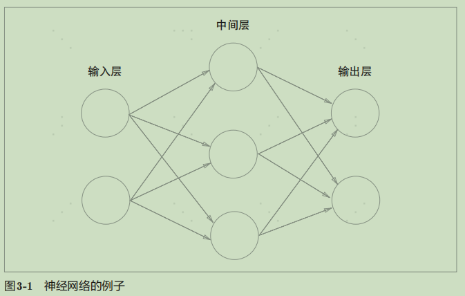
```
y =
  { 0 (b + w1x1 + w2x2 <= 0)
    1 (b + w1x1 + w2x2 >0) } (3.1)
y = h(b + w1x1 + w2x2) (3.2)
h(x) =
  { 0 (x <= 0)
    1 (x > 0) } (3.3)
```
式（3.2）中，输入信号的总和会被函数h(x)转换，转换后的值就是输出y。然后，式（3.3）所表示的函数h(x)，在输入超过0时返回1，否则返回0。因此，式（3.1）和式（3.2）、式（3.3）做的是相同的事情。\
这个感知机将x1、x2、1三个信号作为神经元的输入，将其和各自的权重相乘后，传送至下一个神经元。在下一个神经元中，计算这些加权信号的总和。如果这个总和超过0，则输出1，否则输出0。
## 激活函数
h（x）函数会将输入信号的总和转换为输出信号，这种函数一般称为激活函数（activation function）。如“激活”一词所示，激活函数的作用在于决定如何来激活输入信号的总和。 \
式（3.2）分两个阶段进行处理，先计算输入信号的加权总和，然后用激活函数转换这一总和。因此，如果将式（3.2）写得详细一点，则可以分成下面两个式子。
```
a = b + w1x1 + w2x2 （3.4）
y = h(a)
```
式（3.4）计算加权输入信号和偏置的总和，记为a。然后，式（3.5）用h()函数将a转换为输出y。之前的神经元都是用一个○表示的，如果要在图中明确表示出式（3.4）
和式（3.5），则可以像图3-4这样做。\
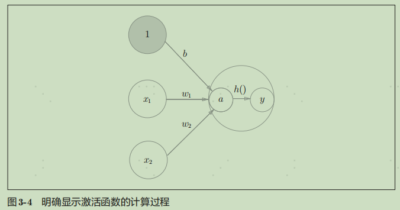 \
式（3.3）表示的激活函数以阈值为界，一旦输入超过阈值，就切换输出。这样的函数称为“阶跃函数”。因此，可以说感知机中使用了阶跃函数作为激活函数。也就是说，在激活函数的众多候选函数中，感知机使用了阶跃函数。
### sigmoid函数
```
h(x) = 1 / (1 + exp(-x))
exp(−x)表示e^−x
```
神经网络中用sigmoid函数作为激活函数，进行信号的转换，转换后的  信号被传送给下一个神经元。实际上，上一章介绍的感知机和接下来要介绍的神经网络的主要区别就在于这个激活函数。其他方面，比如神经元的多层连接的构造、信号的传递方法等，基本上和感知机是一样的。
### 阶跃函数的实现
```
def step_function(x):
  if x > 0:
    return 1
  else:
    return 0

def step_function(x): # 支持NumPy数组的实现
  y = x > 0
  return y.astype(np.int)
```
### 阶跃函数的图形
```
import numpy as np
import matplotlib.pylab as plt

def step_function(x):
  return np.array(x > 0, dtype=np.int)

x = np.arange(-5.0, 5.0, 0.1)
y = step_function(x)
plt.plot(x, y)
plt.ylim(-0.1, 1.1) # 指定y轴的范围
plt.show()
```
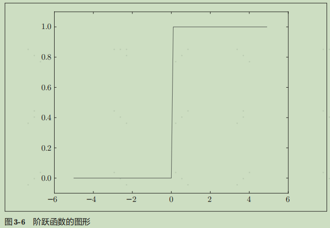 \
如图所示，阶跃函数以0为界，输出从0切换为1（或者从1切换为0）。它的值呈阶梯式变化，所以称为阶跃函数。
### sigmoid函数的实现
```
def sigmoid(x):
  return 1 / (1 + np.exp(-x))

x = np.arange(-5.0, 5.0, 0.1)
y = sigmoid(x)
plt.plot(x, y)
plt.ylim(-0.1, 1.1) # 指定y轴的范围
plt.show()
```
.
### sigmoid函数和阶跃函数的比较
sigmoid函数是一条平滑的曲线，输出随着输入发生连续性的变化。而阶跃函数以0为界，输出发生急剧性的变化。sigmoid函数的平滑性对神经网络的学习具有重要意义。\
相对于阶跃函数只能返回0或1，sigmoid函数可以返回0.731 、0.880 等实数（这一点和刚才的平滑性有关）。\
也就是说，感知机中神经元之间流动的是0或1的二元信号，而神经网络中流动的是连续的实数值信号。 \
两者的结构均是“输入小时，输出接近0（为0）；随着输入增大，输出向1靠近（变成1）”。也就是说，当输入信号为重要信息时，阶跃函数和sigmoid函数都会输出较大的值；当输入信号为不重要的信息时，两者都输出较小的值。还有一个共同点是，不管输入信号有多小，或者有多大，输出信号的值都在0到1之间。
### 非线性函数
神经网络的激活函数必须使用非线性函数。换句话说，激活函数不能使用线性函数。为什么不能使用线性函数呢？因为使用线性函数的话，加深神经网络的层数就没有意义了。
### ReLU函数
ReLU函数在输入大于0时，直接输出该值；在输入小于等于0时，输出0。
```
h(x) = 
  { x (x > 0)
    0 (x <= 0) } (3.7)

def relu(x):
  return np.maximum(0, x)
```
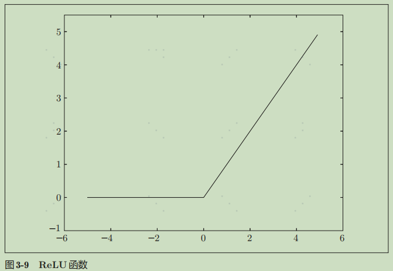.
## 多维数组的运算
NumPy多维数组的运算，可以高效地实现神经网络
### 多维数组
```
>>> import numpy as np
>>> A = np.array([1, 2, 3, 4]) # 一维数组
>>> print(A)
[1 2 3 4]
>>> np.ndim(A)
1
>>> A.shape
(4,)
>>> A.shape[0]
4

>>> B = np.array([[1,2], [3,4], [5,6]]) # 二维数组
>>> print(B)
[[1 2]
 [3 4]
 [5 6]]
>>> np.ndim(B)
2
>>> B.shape
(3, 2)
```
### 矩阵乘法
```
>>> A = np.array([[1,2], [3,4]])
>>> A.shape
(2, 2)
>>> B = np.array([[5,6], [7,8]])
>>> B.shape
(2, 2)
>>> np.dot(A, B)
array([[19, 22],
 [43, 50]])

>>> A = np.array([[1,2,3], [4,5,6]])
>>> A.shape
(2, 3)
>>> B = np.array([[1,2], [3,4], [5,6]])
>>> B.shape
(3, 2)
>>> np.dot(A, B)
array([[22, 28],
 [49, 64]])
```
矩阵A的第1维的元素个数（列数）必须和矩阵B的第0维的元素个数（行数）相等。
### 神经网络的内积
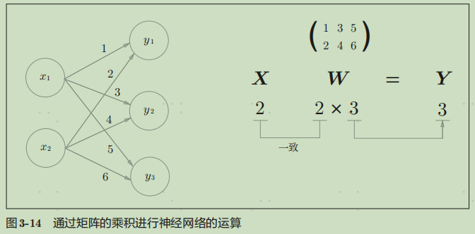 \
实现该神经网络时，要注意X、W、Y的形状，特别是X和W的对应维度的元素个数是否一致，这一点很重要。\
```
>>> X = np.array([1, 2])
>>> X.shape
(2,)
>>> W = np.array([[1, 3, 5], [2, 4, 6]])
>>> print(W)
[[1 3 5]
 [2 4 6]]
>>> W.shape
(2, 3)
>>> Y = np.dot(X, W)
>>> print(Y)
[ 5 11 17]
```
## 3层神经网络的实现
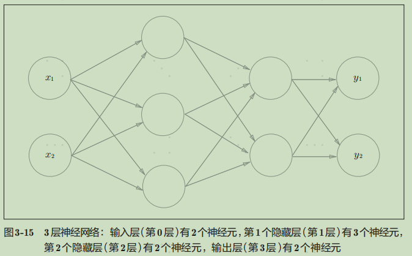.
### 符号确认
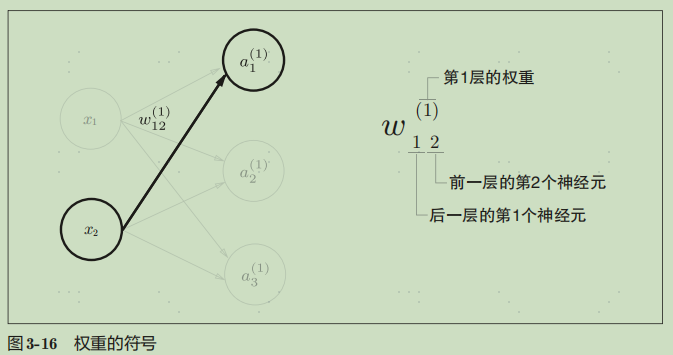.
### 各层间信号传递的实现
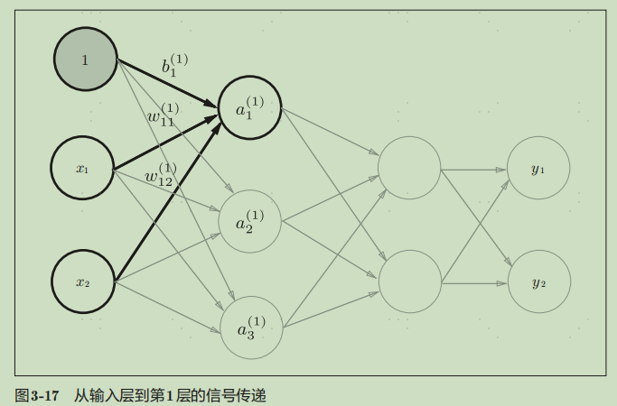\
数学公式: \
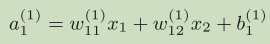\
矩阵的乘法: \
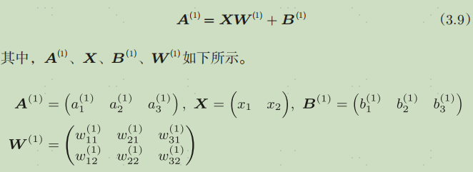\
Numpy数组:
```
X = np.array([1.0, 0.5])
W1 = np.array([[0.1, 0.3, 0.5], [0.2, 0.4, 0.6]])
B1 = np.array([0.1, 0.2, 0.3])
print(W1.shape) # (2, 3)
print(X.shape) # (2,)
print(B1.shape) # (3,)
A1 = np.dot(X, W1) + B1
```
W1是2 × 3的数组，X是元素个数为2的一维数组。这里，W1和X的对应维度的元素个数也保持了一致。\
 \
隐藏层的加权和（加权信号和偏置的总和）用a表示，被激活函数转换后的信号用z表示。此外，图中h()表示激活函数，这里我们使用的是sigmoid函数。
```
Z1 = sigmoid(A1)
print(A1) # [0.3, 0.7, 1.1]
print(Z1) # [0.57444252, 0.66818777, 0.75026011]
```
实现第1层到第2层的信号传递。\
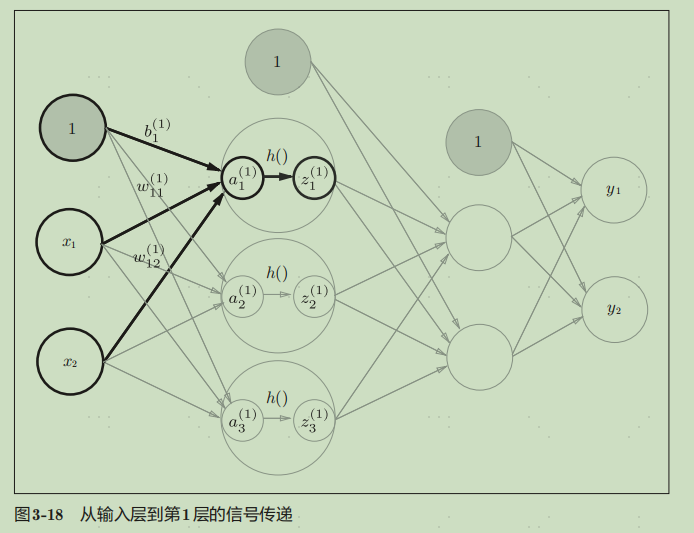 
```
W2 = np.array([[0.1, 0.4], [0.2, 0.5], [0.3, 0.6]])
B2 = np.array([0.1, 0.2])
print(Z1.shape) # (3,)
print(W2.shape) # (3, 2)
print(B2.shape) # (2,)
A2 = np.dot(Z1, W2) + B2
Z2 = sigmoid(A2)
```
最后是第2层到输出层的信号传递。输出层的实现也和之前的实现基本相同。不过，最后的激活函数和之前的隐藏层有所不同。
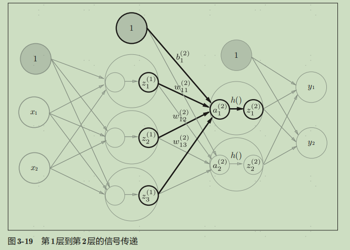 
```
def identity_function(x):
 return x
W3 = np.array([[0.1, 0.3], [0.2, 0.4]])
B3 = np.array([0.1, 0.2])
A3 = np.dot(Z2, W3) + B3
Y = identity_function(A3) # 或者Y = A3
```
输出层所用的激活函数，要根据求解问题的性质决定。一般地，回归问题可以使用恒等函数，二元分类问题可以使用 sigmoid函数，多元分类问题可以使用 softmax函数。
### 代码实现小结
```
def init_network():
 network = {}
 network['W1'] = np.array([[0.1, 0.3, 0.5], [0.2, 0.4, 0.6]])
 network['b1'] = np.array([0.1, 0.2, 0.3])
 network['W2'] = np.array([[0.1, 0.4], [0.2, 0.5], [0.3, 0.6]])
 network['b2'] = np.array([0.1, 0.2])
 network['W3'] = np.array([[0.1, 0.3], [0.2, 0.4]])
 network['b3'] = np.array([0.1, 0.2])
 return network

def forward(network, x):
 W1, W2, W3 = network['W1'], network['W2'], network['W3']
 b1, b2, b3 = network['b1'], network['b2'], network['b3']
 a1 = np.dot(x, W1) + b1
 z1 = sigmoid(a1)
 a2 = np.dot(z1, W2) + b2
 z2 = sigmoid(a2)
 a3 = np.dot(z2, W3) + b3
 y = identity_function(a3)
 return y

network = init_network()
x = np.array([1.0, 0.5])
y = forward(network, x)
print(y) # [ 0.31682708 0.69627909]
```
init_network()函数会进行权重和偏置的初始化，并将它们保存在字典变量network中。这个字典变量network中保存了每一层所需的参数（权重和偏置）。forward()函数中则封
装了将输入信号转换为输出信号的处理过程。另外，这里出现了forward（前向）一词，它表示的是从输入到输出方向的传递处理。后面在进行神经网络的训练时，我们将介绍后向（backward，从输出到输入方向）的处理。
## 输出层的设计


