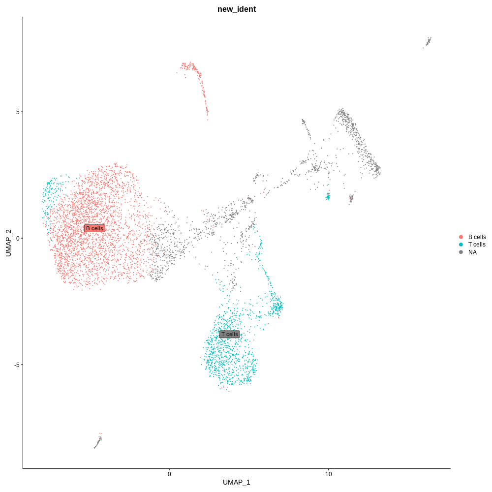
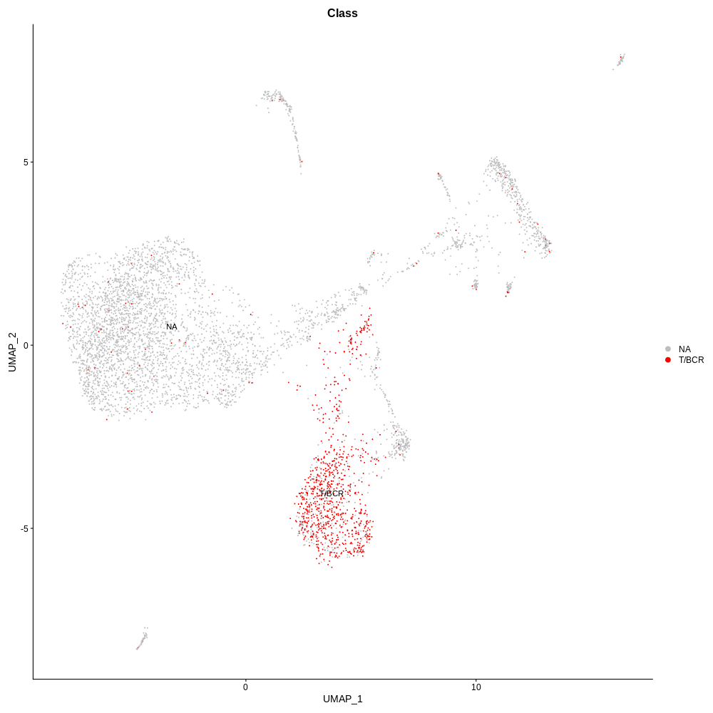

## Joint RNA and VDJ analysis
In this vignette, we’ll demonstrate how to jointly analyze a single-cell full length vdj and single-cell RNA using Seurat. \
scVDJ analysis pipeline https://github.com/Chenjunjie1996/SingleCell_VDJ/blob/master/doc/assay/multi_flv_CR.md \
scRAN analysis pipeline https://github.com/singleron-RD/CeleScope/blob/master/doc/assay/multi_rna.md

## R package required
```
library(Seurat)
library(tidyverse)
library(ggplot2)
library(dplyr)
```

## Input file
1. rds file generated by scRNA result with cell-type annotation info.
2. filtered_contig_annotations.csv 

## Code
```
rna <- readRDS(args$rds)
vdj <- read.table(args$VDJ, sep=',', header=T)
df <- rna@meta.data
df$barcode <- rownames(df)

# filter productive cell barcode
cells <- subset(vdj, productive=='True')
barcodes <- unique(cells$barcode)
filter_df <- filter(df, barcode %in% barcodes)

# calculate assembled cell number in each cluster
df <- table(filter_df$seurat_cluster)
res <- as.data.frame(df)

# add tag to TCR/BCR cell barcode.
meta = rna@meta.data
meta$Class = 'NA'
meta$barcode = rownames(meta)
meta = meta %>%
  mutate(Class = if_else(barcode %in% barcodes,
                         true = "T/BCR",
                         false = "NA"))
meta = dplyr::select(meta, -c("barcode"))
table(meta$Class == 'T/BCR')
rna@meta.data = meta
rna <- RunUMAP(rna, dims = 1:20)

# UMAP-plot for cluster, celltype, class
UMAPPlot(rna,group.by='seurat_cluster',label=TRUE)
UMAPPlot(rna,group.by='celltype',label=TRUE,label.box=TRUE)
UMAPPlot(rna,group.by='Class',cols=c('grey','red'),label=TRUE)

# save meta file get more detailed info
write.csv(rna@meta.data, "meta.csv")
```

## Calculate VDJ Enrichment Efficiency use Pandas
```
import pandas as pd

# common cell type name of T/B cell.
CELL_TYPE_DICT = {
    'TCR':['TCELLS', 'TCELL', 'NKTCELLS', 'TANDNK', 'TREG', 'TH1', 'CD4NAIVET', 'CD8TEFF', 'TH17'],
    'BCR':['MATUREBCELL', 'PLASMACELLS', 'BCELLS', 'BCELL', 'PREBCELLCD34'],
    }

df = pd.read_csv(meta)

# celltype column name in meta.
ident = 'celltype'
df[ident] = df[ident].apply(lambda x: re.sub(r"[^a-zA-Z0-9]","", str(x)).upper())
df_count = df[df[ident].isin(mapping_cell_type)]

assembled_cell_count.append(int(df_count['Class'].value_counts()))
total_cell_count.append(int(df_count.shape[0]))
percent = assembled_cell_count / total_cell_count
```

## Result
### UMAPPLOT for cell-type
.
### UMAPPLOT for VDJ Enrichment Efficiency
.
### [Assembled cell number in each cluster](./match_barcodes_celltypes_distribution.txt)
