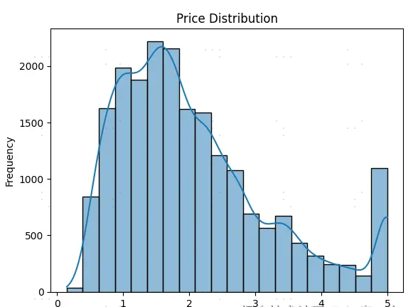
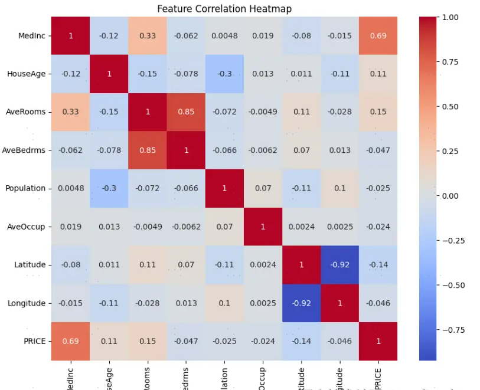

## 什么是AI模型
AI 模型是通过训练得到的一种程序，能够利用海量数据学习规律，并在此基础上完成各种任务。

## 模型如何学习
喂数据：提供大量样本，让模型了解世界的“规律”。
定义目标：明确任务，例如判断图片中是狗还是猫。
反复训练：模型不断调整其“参数”（类似脑回路），以优化对数据的理解。
测试与应用：在实际场景中运行模型，评估其效果。

## AI 模型的类型
根据任务的性质，AI 模型主要分为以下几类：
分类模型：识别类别，例如垃圾邮件分类。
回归模型：预测数值，例如房价预测。
生成模型：创造内容，例如生成图像或文本。

## 什么是“大模型”？
大模型是相对于传统 AI 模型而言的，指的是参数规模大、学习能力强的模型。它们拥有强大的数据处理和推理能力，能够应对复杂任务。例如，GPT 系列模型不仅可以完成写作任务，还能实现编程、回答问题等多种功能，表现得更加“聪明”。

## 必要的 Python 库
```
pip install numpy 
pip install pandas 
pip install matplotlib 
pip install seaborn scikit-learn 
pip install tensorflow
```
NumPy：用于高效的数学计算和数组操作。
Pandas：强大的数据处理与分析工具。
Matplotlib/Seaborn：用于数据可视化，展示数据分布和关系。
Scikit-learn：经典的机器学习库，支持分类、回归和聚类等任务。
TensorFlow：深度学习框架，用于构建和训练神经网络。

## 数据是 AI 的粮食
在 AI 项目中，数据是模型的基础，就像粮食之于人类。没有数据，模型就无法“成长”。
开源平台：如 Kaggle 和 UCI Machine Learning Repository 提供了丰富的高质量数据集，适合各种任务和领域。
Sklearn 自带数据集：内置数据集，如加利福尼亚房价、鸢尾花数据集，简单易用，适合初学者入门练习。

```
from sklearn.datasets import fetch_california_housing
import pandas as pd
​
# 加载 California Housing 数据集
housing = fetch_california_housing()
data = pd.DataFrame(housing.data, columns=housing.feature_names)
data['PRICE'] = housing.target
​
# 查看数据
print(data.head())
```

## 数据探索与可视化
在训练模型之前，数据探索是至关重要的一步。通过探索，我们可以了解数据的结构、分布特征以及特征间的关系，为后续的数据清洗和建模奠定基础。
```
# 查看数据统计信息
print(data.describe())

# 可视化分布
import matplotlib.pyplot as plt
import seaborn as sns
​
# 绘制分布图
sns.histplot(data['PRICE'], kde=True, bins=20)
plt.title("Price Distribution") # 房价分布
plt.xlabel("Price") # 房价
plt.ylabel("Frequency") # 频数
plt.show()
```
.
```

# 相关性分析
# 绘制特征相关性热力图
plt.figure(figsize=(10, 8))
sns.heatmap(data.corr(), annot=True, cmap='coolwarm')
plt.title("Feature Correlation Heatmap") # 特征相关性热力图
plt.show()
```
.

## 数据清洗与预处理
在训练模型之前，数据需要经过“加工”，以便让模型更高效地学习。常见的清洗与预处理步骤包括检查缺失值、处理异常值和标准化特征。
```
# 检查缺失值
data.isnull().sum()
# 数据标准化
from sklearn.preprocessing import StandardScaler
​
# 特征标准化
scaler = StandardScaler()
features = data.drop('PRICE', axis=1)
target = data['PRICE']
features_scaled = scaler.fit_transform(features)
```

## 训练一个简单的模型
```
from sklearn.model_selection import train_test_split
​
# 划分训练集和测试集
X_train, X_test, y_train, y_test = train_test_split(features_scaled, target, test_size=0.2, random_state=42)

# 训练线性回归模型
from sklearn.linear_model import LinearRegression
from sklearn.metrics import mean_squared_error, r2_score
​
# 初始化模型
model = LinearRegression()
​
# 训练模型
model.fit(X_train, y_train)
​
# 预测
y_pred = model.predict(X_test)
​
# 评估性能
mse = mean_squared_error(y_test, y_pred)
r2 = r2_score(y_test, y_pred)
print(f"均方误差（MSE）：{mse}")
print(f"R2 分数：{r2}")

>>> 均方误差（MSE）：0.555891598695244
>>> R2 分数：0.5757877060324511
```
# 模型效果解读
MSE（均方误差） ：衡量预测值与真实值之间的平均偏差，值越小表示模型表现越好。\
R²分数：表示模型解释数据方差的比例，值越接近 1，说明模型拟合度越高。
